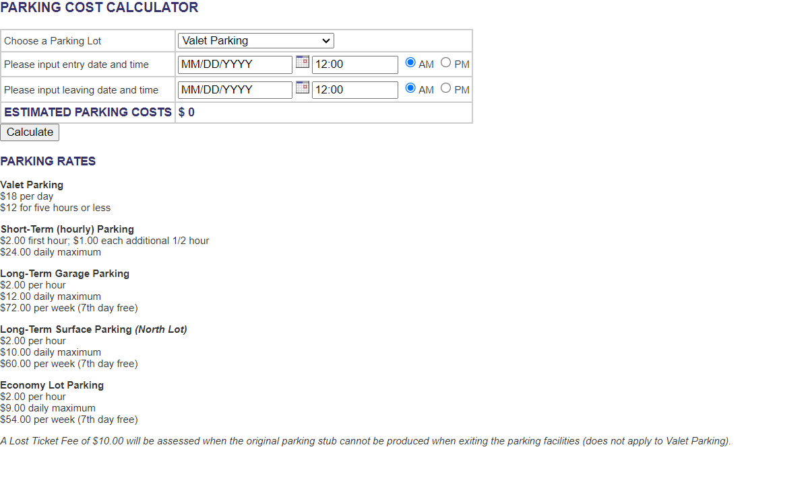

Cette session de test à été realisée dans le cadre d'une formation LinkedIN Learning [Test logiciels et assurance qualité](https://www.linkedin.com/learning-login/share?account=104347298&forceAccount=false&redirect=https%3A%2F%2Fwww.linkedin.com%2Flearning%2Fles-fondements-de-la-programmation-tests-logiciels-et-assurance-qualite-qa%3Ftrk%3Dshare_ent_url%26shareId%3D0hY3R4bqTLKowTfmxzTIIw%253D%253D)

# Déroulement de la session de test exploratoire 
Participants : RAJON Kevin

## Objectif de test : Définir votre mission
 - Tester la réservation d’un parking en ligne
 - https://www.shino.de/parkcalc/index.php

## Charte à tester
 - Explorer: la fonctionnalité de réservation de parking  
 - En tant que: conducteur curieux et malin 
 - Avec: des dates et horaires non cohérentes et utilisant tous les champs et les boutons de l’interface
 - Pour découvrir: Les cas extrêmes non couverts par la validation du site de parking

## Temps de la session : 30min | **Temps passé dans l’exécution : 15m**

 - Dans les champs liés à la date d’arrivée et de sortie :
        ◦ Entrer des caractères spéciaux 
        ◦ Entrer des lettres 
        ◦ Supprimer les dates complètement 
        ◦ Utiliser des dates dans le passé 
        ◦ Choisir la même date mais des horaires différents inversés (2:00PM jusqu’au 2:AM) 
 - Anomalies, problèmes, nouvelles idées, questions  
        ◦ Anomalies trouvées : 
            ▪ Le prix s’affiche même si les dates sont invalides 
            ▪ Aucun message d’erreur n’est affiché suite à la saisie des données invalides 
            ▪ La réservation ne doit pas être possible en utilisant des dates dans le passé 
            ▪ Le système n’affiche pas un message d’erreur quand l’ordre des horaires (AM et PM) ne sont pas respectés durant la même journée 
            ▪ Double clique sur le bouton donne un prix égal à 0 
 - Questions : 
            ▪ Quel est la formule de calcul du prix de parking ? 
        ◦ Nouvelles idées 
            ▪ Explorer la différence des différents types de parking 
            ▪ Est-ce qu’il y a une API impliquée pour le calcul des Prix ? 

## Périmètre :
 - Fonctionnalités à tester : 
   ▪ Le prix du parking, la réservation du parking 
 - Fonctionnalités à ne pas tester : 
   ▪ Les types de parking 

## Débriefing

 - Ce qui s’est passé ? 
   ▪ Exploration des fonctions de reservation et calcul de tarif  

 - Qu’est-ce qui vous gêne ? 
   ▪ Interface intuitive mais pas très moderne et laissant place à l’erreur (date passée, inversion date future/passée) 

 - Qu’est-ce qu’il reste à faire ? 
   ▪ Explorer la différence des différents types de parking et la formule de calcul de prix ? 

   ▪ L’application n’est pas sécurisée pour faire le paiement.
Interface viellissante.

